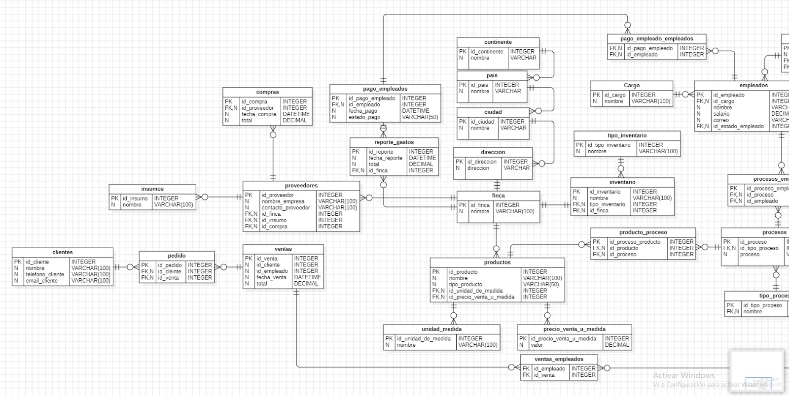
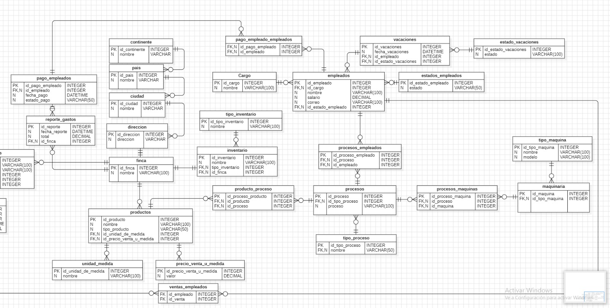

# 👨‍🌾 Proyecto de Base de Datos de la Granja 🧑‍🌾

## Descripción del Proyecto

Este proyecto consiste en una base de datos diseñada para gestionar las operaciones de una granja agrícola. La base de datos incluye diversas tablas que almacenan información sobre fincas, productos, proveedores, clientes, ventas, empleados y otros aspectos importantes de la gestión agrícola. El objetivo es facilitar el acceso y manejo de datos, permitiendo la generación de informes y la toma de decisiones informadas.

## Estructura de la Base de Datos

La base de datos contiene las siguientes tablas:

- **Continente**: Información sobre continentes.
- **País**: Información sobre países y su relación con continentes.
- **Ciudad**: Datos sobre ciudades y su relación con países.
- **Dirección**: Almacena las direcciones y su relación con ciudades.
- **Finca**: Información sobre las fincas agrícolas.
- **Proveedores**: Datos de los proveedores que suministran insumos.
- **Compras**: Registro de las compras realizadas a proveedores.
- **Insumos**: Información sobre los insumos disponibles.
- **Productos**: Datos sobre los productos que se venden.
- **Unidad de Medida**: Almacena las unidades de medida utilizadas.
- **Precio de Venta por Unidad**: Información sobre los precios de venta.
- **Clientes**: Datos de los clientes.
- **Ventas**: Registro de las ventas realizadas a clientes.
- **Empleados**: Información sobre los empleados de la granja.
- **Vacaciones**: Registro de las vacaciones de los empleados.


## Diagrama de Base de Datos




## Configuración de la Base de Datos

Para configurar la base de datos, sigue estos pasos:

1. **Instalar MySQL**: Asegúrate de tener MySQL instalado en tu sistema.
2. **Crear la Base de Datos**: Ejecuta el siguiente comando en tu cliente de MySQL:

```sql
    CREATE DATABASE granja_agricolaMYSQL;

    USE granja_agricolaMYSQL;
```
## 📝 Consultas SQL Documentadas

**Calcular el total de compras realizadas a un proveedor específico**
```sql
SELECT SUM(c.total) AS total_compras
FROM compras c
JOIN proveedores p ON c.id_proveedor = p.id_proveedor
WHERE p.nombre_empresa = 'Cosechas Locales'; 


```

**Obtener los productos cuyo precio es mayor al precio promedio por tipo de producto**
```sql
SELECT p.nombre, p.tipo_producto, pm.valor AS precio
FROM productos p
JOIN precio_venta_u_medida pm ON p.id_precio_venta_u_medida = pm.id_precio_venta_u_medida
WHERE pm.valor > (SELECT AVG(pm2.valor) 
                  FROM productos p2 
                  JOIN precio_venta_u_medida pm2 ON p2.id_precio_venta_u_medida = pm2.id_precio_venta_u_medida 
                  WHERE p.tipo_producto = p2.tipo_producto);
```

**Mostrar las fincas que tienen al menos 3 empleados asignados a ellas**
```sql
SELECT f.nombre, COUNT(e.id_empleado) AS total_empleados
FROM finca f
JOIN empleados e ON f.id_finca = e.id_empleado
GROUP BY f.nombre
HAVING COUNT(e.id_empleado) >= 3;
```

**Obtener los empleados que han recibido el salario más alto en los últimos 3 meses**
```sql
SELECT e.nombre, MAX(pe.fecha_pago) AS ultima_fecha_pago, e.salario
FROM empleados e
JOIN pago_empleados pe ON e.id_empleado = pe.id_empleado
WHERE pe.fecha_pago >= DATE_SUB(CURDATE(), INTERVAL 3 MONTH)  
GROUP BY e.nombre, e.salario
ORDER BY e.salario DESC
LIMIT 5;  

```

**Contar el número de productos por tipo de producto**
```sql
SELECT p.tipo_producto, COUNT(p.id_producto) AS total_productos
FROM productos p
GROUP BY p.tipo_producto
HAVING COUNT(p.id_producto) > 0;


```

**Obtener el promedio de salario de los empleados por cada cargo**
```sql
SELECT ca.nombre AS cargo, AVG(e.salario) AS promedio_salario
FROM empleados e
JOIN Cargo ca ON e.id_cargo = ca.id_cargo
GROUP BY ca.id_cargo;


```


**Obtener el total de compras por proveedor y mostrar solo aquellos que hayan realizado compras superiores a 1000 unidades monetarias**
```sql
SELECT p.nombre_empresa AS proveedor, SUM(c.total) AS total_compras
FROM proveedores p
JOIN compras c ON p.id_proveedor = c.id_proveedor
GROUP BY p.id_proveedor
HAVING SUM(c.total) > 1000;
```

**Obtener la cantidad total de insumos comprados por cada proveedor, mostrando solo aquellos que hayan comprado más de 10 insumos**
```sql
SELECT i.nombre AS insumo, SUM(v.total) AS total_gastado_en_insumo
FROM insumos i
JOIN pedido ped ON i.id_insumo = ped.id_insumo
JOIN ventas v ON ped.id_venta = v.id_venta
GROUP BY i.id_insumo
ORDER BY total_gastado_en_insumo DESC;
```

**Obtener el total de gastos reportados en todos los reportes de gastos**
```sql
SELECT SUM(rg.total) AS total_gastos
FROM reporte_gastos rg;

```

**Listar las fechas de vacaciones de los empleados**
```sql
SELECT e.nombre, v.fecha_vacaciones
FROM empleados e
JOIN vacaciones v ON e.id_empleado = v.id_empleado;

```

**Obtener el nombre de los productos que están asociados a procesos.**
```sql
SELECT p.nombre AS producto
FROM productos p
JOIN producto_proceso pp ON p.id_producto = pp.id_producto;

```

**istar los empleados y su estado actual (empleado activo o no).**
```sql
SELECT e.nombre, ee.estado
FROM empleados e
JOIN estados_empleados ee ON e.id_estado_empleado = ee.id_estado_empleado;


```

**Obtener la lista de empleados y su salario, junto con el promedio de salario de su respectivo cargo.**
```sql
SELECT e.nombre, e.salario, c.nombre AS cargo, 
       (SELECT AVG(salario) 
        FROM empleados 
        WHERE id_cargo = e.id_cargo) AS promedio_salario
FROM empleados e
JOIN Cargo c ON e.id_cargo = c.id_cargo;


```

## 📌 Funciones SQL

**Contar el número de procesos realizados en la finca**

```sql
DELIMITER //
CREATE FUNCTION contar_procesos_finca(p_id_finca INT)
RETURNS INT
DETERMINISTIC
BEGIN
    DECLARE v_total_procesos INT;
    SELECT COUNT(*) INTO v_total_procesos
    FROM procesos
    WHERE id_finca = p_id_finca;
    RETURN v_total_procesos;
END//
DELIMITER ;

```

**Calcular el total de gastos operativos en un periodo**

```sql
DELIMITER //
CREATE FUNCTION total_gastos_operativos_periodo(p_fecha_inicio DATE, p_fecha_fin DATE)
RETURNS DECIMAL(10,2)
DETERMINISTIC
BEGIN
    DECLARE v_total_gastos DECIMAL(10,2);
    SELECT SUM(total) INTO v_total_gastos
    FROM reporte_gastos
    WHERE fecha_reporte BETWEEN p_fecha_inicio AND p_fecha_fin;
    RETURN v_total_gastos;
END//
DELIMITER ;

```

**Función para estimar el costo operativo total de la finca en un periodo de tiempo**

```sql
DELIMITER //
CREATE FUNCTION estimar_costo_operativo(p_fecha_inicio DATE, p_fecha_fin DATE)
RETURNS DECIMAL(10,2)
DETERMINISTIC
BEGIN
    DECLARE v_total DECIMAL(10,2);
    SELECT SUM(total) INTO v_total
    FROM reporte_gastos
    WHERE fecha_reporte BETWEEN p_fecha_inicio AND p_fecha_fin;
    RETURN v_total;
END//
DELIMITER ;

```

**Función para obtener el total de ventas realizadas en un periodo**

```sql
DELIMITER //
CREATE FUNCTION total_ventas_periodo(p_fecha_inicio DATE, p_fecha_fin DATE)
RETURNS DECIMAL(10,2)
DETERMINISTIC
BEGIN
    DECLARE v_total_ventas DECIMAL(10,2);
    SELECT SUM(total) INTO v_total_ventas
    FROM ventas
    WHERE fecha_venta BETWEEN p_fecha_inicio AND p_fecha_fin;
    RETURN v_total_ventas;
END//
DELIMITER ;

```

**Función para contar el número de empleados activos**

```sql
DELIMITER //
CREATE FUNCTION contar_empleados_activos()
RETURNS INT
DETERMINISTIC
BEGIN
    DECLARE v_numero_empleados INT;
    SELECT COUNT(*) INTO v_numero_empleados
    FROM empleados
    WHERE id_estado_empleado = 1; 

    RETURN v_numero_empleados;
END//
DELIMITER ;
```

## 💻 Triggers SQL Documentados

**Trigger para evitar que el total de ventas sea menor al costo de producción**

```sql
CREATE TRIGGER verificar_total_venta
BEFORE INSERT ON ventas
FOR EACH ROW
BEGIN
    DECLARE total_produccion DECIMAL;
    SET total_produccion = (SELECT SUM(precio_venta_u_medida.valor) FROM productos WHERE id_producto = NEW.id_venta);
    IF NEW.total < total_produccion THEN
        SIGNAL SQLSTATE '45000' SET MESSAGE_TEXT = 'El total de la venta no puede ser menor al costo de producción.';
    END IF;
END;

```

**Trigger para actualizar el stock del inventario al realizar una compra**

```sql
CREATE TRIGGER actualizar_inventario_compra
AFTER INSERT ON compras
FOR EACH ROW
BEGIN
    UPDATE inventario
    SET cantidad = cantidad + 1
    WHERE id_producto = (SELECT id_producto FROM insumos WHERE id_proveedor = NEW.id_proveedor);
END;

```

**Trigger para bloquear la eliminación de un cliente si tiene pedidos pendientes**

```sql
CREATE TRIGGER bloquear_eliminacion_cliente_pedido
BEFORE DELETE ON clientes
FOR EACH ROW
BEGIN
    IF EXISTS (SELECT 1 FROM pedido WHERE id_cliente = OLD.id_cliente) THEN
        SIGNAL SQLSTATE '45000' SET MESSAGE_TEXT = 'No se puede eliminar el cliente con pedidos pendientes.';
    END IF;
END;

```

**Trigger para registrar cualquier modificación en la información de clientes**

```sql
CREATE TRIGGER registrar_modificacion_cliente
AFTER UPDATE ON clientes
FOR EACH ROW
BEGIN
    INSERT INTO historial_modificaciones_cliente (id_cliente, cambio, fecha)
    VALUES (NEW.id_cliente, CONCAT('Modificación: ', OLD.nombre, ' a ', NEW.nombre), NOW());
END;

```

**Trigger para verificar la capacidad de la finca antes de asignarle un inventario adicional**

```sql
CREATE TRIGGER verificar_capacidad_finca
BEFORE INSERT ON inventario
FOR EACH ROW
BEGIN
    DECLARE capacidad_actual INT;
    SET capacidad_actual = (SELECT COUNT(*) FROM inventario WHERE id_finca = NEW.id_finca);
    IF capacidad_actual >= 100 THEN
        SIGNAL SQLSTATE '45000' SET MESSAGE_TEXT = 'La finca no puede almacenar más inventario.';
    END IF;
END;

```

# 🎮 Procedimientos Almacenados Documentados

**Procedimiento para registrar un proceso de un producto**

```sql
DELIMITER //
CREATE PROCEDURE registrar_proceso_producto(
    IN p_id_producto INT,
    IN p_id_proceso INT
)
BEGIN
    INSERT INTO producto_proceso (id_producto, id_proceso)
    VALUES (p_id_producto, p_id_proceso);
END//
DELIMITER ;


```

**Procedimiento para registrar una compra**

```sql
DELIMITER //
CREATE PROCEDURE registrar_compra(
    IN p_id_proveedor INT,
    IN p_fecha_compra DATETIME,
    IN p_total DECIMAL
)
BEGIN
    INSERT INTO compras (id_proveedor, fecha_compra, total)
    VALUES (p_id_proveedor, p_fecha_compra, p_total);
END//
DELIMITER ;


```

**Procedimiento para actualizar el estado de vacaciones de un empleado**

```sql
DELIMITER //
CREATE PROCEDURE actualizar_estado_vacaciones(
    IN p_id_empleado INT,
    IN p_id_estado_vacaciones INT
)
BEGIN
    UPDATE vacaciones
    SET id_estado_vacaciones = p_id_estado_vacaciones
    WHERE id_empleado = p_id_empleado;
END//
DELIMITER ;


```

**Procedimiento para registrar un nuevo reporte de gastos**

```sql
DELIMITER //
CREATE PROCEDURE registrar_reporte_gastos(
    IN p_fecha_reporte DATETIME,
    IN p_total DECIMAL
)
BEGIN
    INSERT INTO reporte_gastos (fecha_reporte, total)
    VALUES (p_fecha_reporte, p_total);
END//
DELIMITER ;

```

**Procedimiento para asignar una máquina a un proceso**

```sql
DELIMITER //
CREATE PROCEDURE asignar_maquina_a_proceso(
    IN p_id_maquina INT,
    IN p_id_proceso INT
)
BEGIN
    INSERT INTO procesos_maquinas (id_maquina, id_proceso)
    VALUES (p_id_maquina, p_id_proceso);
END//
DELIMITER ;

```

## 💻 Eventos SQL Documentados

**Actualizar Stock de Insumos Diariamente**

```sql
DELIMITER //
CREATE EVENT actualizar_stock_insumos
ON SCHEDULE EVERY 1 DAY
DO
BEGIN
    
    UPDATE inventario SET cantidad = cantidad - (SELECT SUM(cantidad) FROM ventas WHERE id_insumo = inventario.id_insumo);
END//
DELIMITER ;
```

**Notificación de Vacaciones de Empleados**

```sql
DELIMITER //
CREATE EVENT notificacion_vacaciones_empleados
ON SCHEDULE EVERY 1 WEEK
DO
BEGIN

    INSERT INTO notificaciones (mensaje, fecha) 
    SELECT CONCAT('Solicitudes de vacaciones pendientes para: ', nombre) AS mensaje, NOW()
    FROM empleados WHERE estado_vacaciones = 'Pendiente';
END//
DELIMITER ;
```
**Registro de Compras Mensuales**

```sql
DELIMITER //
CREATE EVENT registro_compras_mensuales
ON SCHEDULE EVERY 1 MONTH
DO
BEGIN
 
    INSERT INTO informes_compras (total_compras, mes, anio)
    SELECT SUM(total), MONTH(fecha_compra), YEAR(fecha_compra)
    FROM compras WHERE MONTH(fecha_compra) = MONTH(NOW()) AND YEAR(fecha_compra) = YEAR(NOW());
END//
DELIMITER ;
```

**Cerrar el Registro de Compras a Fin de Mes**

```sql
DELIMITER //
CREATE EVENT cerrar_registro_compras
ON SCHEDULE LAST DAY OF MONTH
DO
BEGIN
  
    INSERT INTO informes_cierre_compras (fecha_cierre, total_compras)
    SELECT NOW(), SUM(total) FROM compras WHERE MONTH(fecha_compra) = MONTH(NOW());
END//
DELIMITER ;
```

**Actualizar Estado de Productos Vencidos**

```sql
DELIMITER //
CREATE EVENT actualizar_productos_vencidos
ON SCHEDULE EVERY 1 DAY
DO
BEGIN
   
    UPDATE productos SET estado = 'Vencido' WHERE fecha_vencimiento < NOW();
END//
DELIMITER ;
```

## Descripción de Usuarios 🧑‍🌾

El sistema de gestión de la base de datos de la granja está diseñado para diferentes tipos de usuarios, cada uno con roles y permisos específicos. A continuación se detallan los tipos de usuarios y sus funciones:

### 1. Administrador
- **Descripción**: Este usuario tiene acceso completo a todas las funcionalidades del sistema. Es responsable de la gestión de otros usuarios, configuración del sistema y supervisión general de las operaciones de la granja.
- **Permisos**:
  - Crear, leer, actualizar y eliminar registros en todas las tablas.
  - Gestionar la asignación de roles y permisos a otros usuarios.

### 2. Empleado
- **Descripción**: Este usuario representa al personal que trabaja en la granja. Tiene acceso a funcionalidades relacionadas con su trabajo diario, como registrar procesos y gestionar la asistencia a eventos.
- **Permisos**:
  - Leer registros relacionados con las actividades asignadas.
  - Registrar su propia asistencia a eventos.
  - Actualizar información personal.

### 3. Proveedor
- **Descripción**: Este usuario representa a los proveedores de insumos y materiales para la granja. Puede acceder a información relacionada con sus productos y compras realizadas.
- **Permisos**:
  - Leer registros de compras y productos asociados.
  - Actualizar información sobre sus productos.

### 4. Gerente
- **Descripción**: Este usuario tiene un rol intermedio, supervisando a los empleados y gestionando las operaciones diarias de la granja. Puede acceder a reportes y estadísticas de rendimiento.
- **Permisos**:
  - Leer y actualizar registros de empleados, insumos y procesos.
  - Generar reportes sobre actividades de la granja.

### 5. Contable
- **Descripción**: Este usuario se encarga de las finanzas de la granja. Tiene acceso a registros de compras, pagos y reportes de gastos.
- **Permisos**:
  - Leer y actualizar registros de pagos y reportes de gastos.
  - Gestionar información relacionada con las transacciones financieras.
